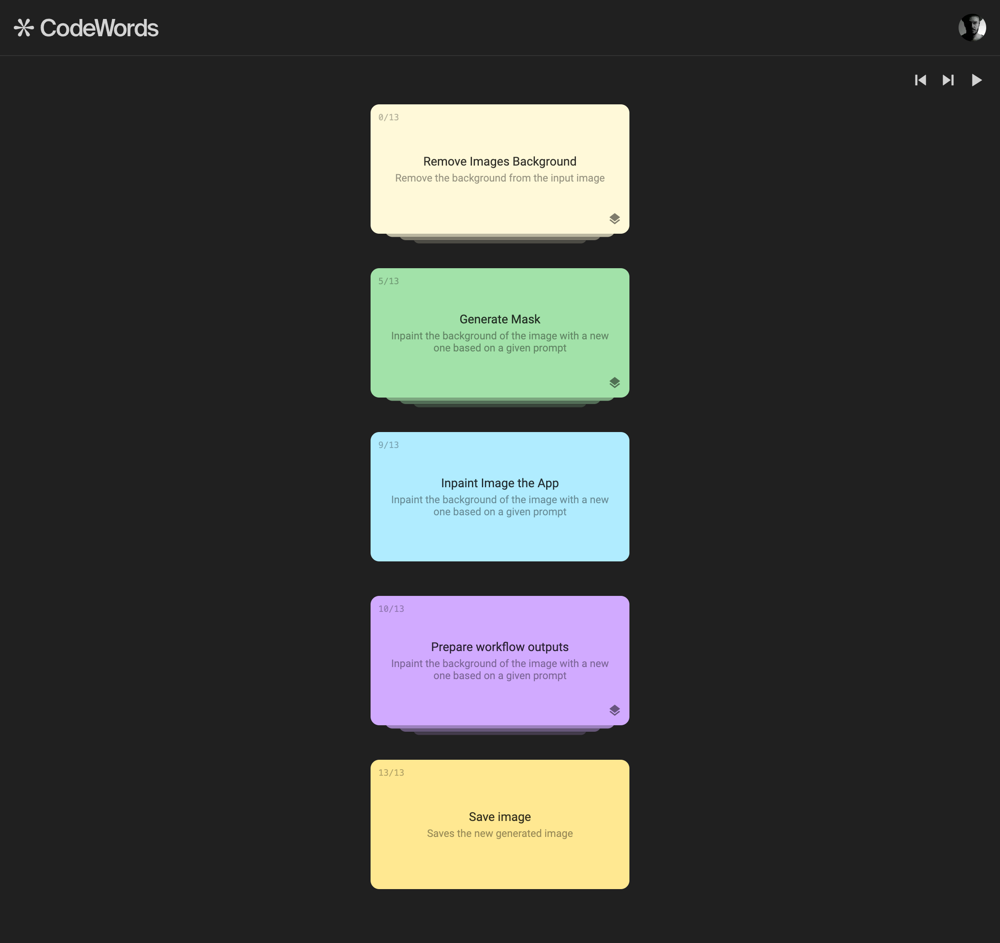

  

## Introduction

This repository was created for a take-home exercise for agemo.ai.

[Brief](https://agemo.notion.site/Product-Engineer-Take-Home-Task-Andr-23f215f860b0405684a573b4e5716591)

## The Issue

The current implementation of CodeWords uses a node graph tool, and as cool as it is to drag each card and reposition them on the canvas, the functionality offers no utility.

- **Complexity Overload:** Introducing React Flow might add unnecessary complexity to the user interface. Users may find it overwhelming to navigate through a flowchart-like visualization, especially if the content primarily consists of linear steps.

- **Cognitive Load:** Users might spend more time understanding the visual representation rather than focusing on the content itself. This can lead to increased cognitive load and reduced efficiency in completing tasks.

- **Over-engineering:** Implementing React Flow for a linear process may be perceived as over-engineering, as it introduces a level of sophistication that exceeds the actual needs of the users.

## The Solution

CodeWords needs a visualization of steps. Each step can have sub-steps. To simplify the visual language, any step with sub-steps is grouped in a stack, which is represented along the z-axis.

- **Topic-Based Navigation:** Organizing the content by topic provides a more intuitive and focused navigation experience for users. Each topic can be presented as a separate section, allowing users to easily locate and access the information they need.

- **Clear Hierarchical Structure:** Grouping content by topic establishes a clear hierarchical structure, with topics serving as high-level categories and subtopics providing further granularity. This approach enhances clarity and facilitates efficient information retrieval.

- **Flexibility and Scalability:** Structuring the content by topic offers flexibility and scalability, allowing for seamless expansion and addition of new topics or subtopics as needed. This ensures that the website remains adaptable to evolving requirements and user preferences.

## Future Thinking

This solution could be expanded to include animations. When a user opens a stack, instead of rebuilding the UI, the stack could expand vertically, pushing the items below it.

At that point, subtasks should be connected to easily identify an open task.
